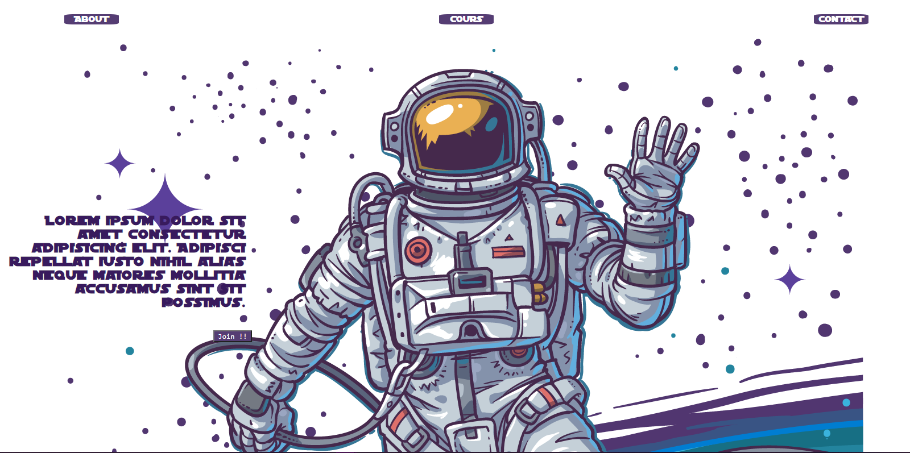

# Cours Et Tps Web 2022
this cours and labs are proposed for student of "tic" second level.

> ## Tp1: (simple) Landing page:
> #### objectifs :
>
> - Premiere approche:
>   - Installation de l'environement.
>   - Insertion des elements html.
>   
> - Manipulation des elements html avec CSS:
>   - Creation de navbar
>   - Positionement de texte et image
>   - Effet hover 
>
>  
>
>  
 Capture d'ecran du  **TP1**

